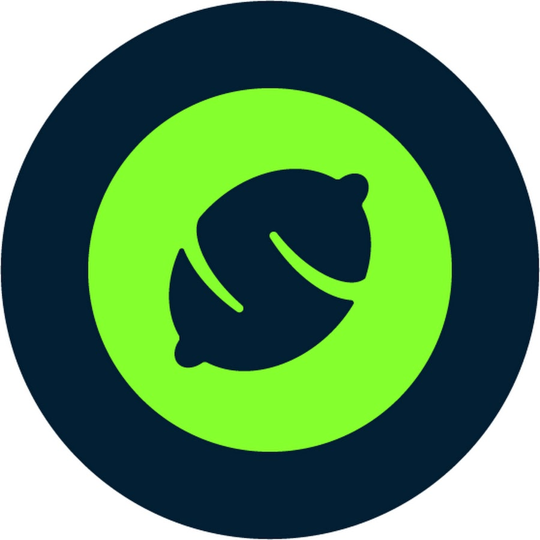

_<!-- PROJECT LOGO -->_
<br />
<div align="center">
  <a href="https://github.com/titiloxx/lemonChallenge">
    
  </a>

<h3 align="center">Lemon Challenge</h3>

  <p align="center">
    Funny and easy interaction with foaas API.
    <br />
    <br />
    <br />
    <a href="https://lemonchallenge.kgji2b94avk8e.us-east-1.cs.amazonlightsail.com/getFoaas">View Demo</a>
    ·
    <a href="https://github.com/titiloxx/lemonChallenge/issues">Report Bug</a>
    ·
    <a href="https://github.com/titiloxx/lemonChallenge/issues">Request Feature</a>
  </p>
</div>

<!-- TABLE OF CONTENTS -->
<details>
  <summary>Table of Contents</summary>
  <ol>
    <li>
      <a href="#about-the-project">About The Project</a>
      <ul>
        <li><a href="#built-with">Built With</a></li>
      </ul>
    </li>
    <li>
      <a href="#getting-started">Getting Started</a>
      <ul>
        <li><a href="#prerequisites">Prerequisites</a></li>
        <li><a href="#installation">Installation</a></li>
      </ul>
    </li>
    <li><a href="#usage">Usage</a></li>
    <li><a href="#license">License</a></li>
    <li><a href="#contact">Contact</a></li>
  </ol>
</details>


<!-- ABOUT THE PROJECT -->
## About The Project

Lemon challenge is an API service that lets you interact with the [FoAAS](https://foaas.com) API and get a secret message.


### Built With

* [Kotlin](https://kotlinlang.org/)
* [Spring Boot](https://spring.io/projects/spring-boot)
* [Maven](https://maven.apache.org/)
* [Docker](https://www.docker.com/)


<!-- GETTING STARTED -->
## Getting Started

### Prerequisites

You need Docker installed and configured to run this project.

Configure MAX_TIME and MAX_RETRIES as environment variables.

By default, the project uses the following values:

MAX_TIME = 10000 

MAX_RETRIES = 5

### Installation

1. Clone the repo
   ```sh
   git clone https://github.com/titiloxx/lemonChallenge
   ```
2. Build image
   ```
   docker build -t lemonchallenge .
   ```
3. Run container
   ```
   docker run --publish 8080:8080 lemonchallenge
   ```

A server will be running at `http://localhost:8080/`. There is only one endpoint available: `/getFoaas`.


<!-- USAGE EXAMPLES -->
## Usage
You must provide a "userId" as a header parameter. This can be any string.

Each user can only get a secret message MAX_RETRIES each MAX_TIME seconds.

_All methods are available at `http://localhost:8080/getFoaas`_

### Usage Examples

```
GET http://localhost:8080/getFoaas

Header:
  UserId: "titiloxx"

Response:
  Fuck you, you're a fucking
```

<!-- CONTRIBUTING -->
## Contributing

Contributions are what make the open source community such an amazing place to learn, inspire, and create. Any contributions you make are **greatly appreciated**.

If you have a suggestion that would make this better, please fork the repo and create a pull request. You can also simply open an issue with the tag "enhancement".
Don't forget to give the project a star! Thanks again!

1. Fork the Project
2. Create your Feature Branch (`git checkout -b feature/AmazingFeature`)
3. Commit your Changes (`git commit -m 'Add some AmazingFeature'`)
4. Push to the Branch (`git push origin feature/AmazingFeature`)
5. Open a Pull Request


<!-- LICENSE -->
## License

Distributed under the MIT License. See `LICENSE.txt` for more information.


<!-- CONTACT -->
## Contact

Agustin Albiero  - titiloxx@gmail.com

Project Link: [https://github.com/titiloxx/lemonChallenge](https://github.com/titiloxx/lemonChallenge)

<p align="right">(<a href="#top">back to top</a>)</p>

<!-- MARKDOWN LINKS & IMAGES -->
<!-- https://www.markdownguide.org/basic-syntax/#reference-style-links -->
[contributors-shield]: https://img.shields.io/github/contributors/othneildrew/lemonChallenge.svg?style=for-the-badge
[contributors-url]: https://github.com/othneildrew/lemonChallenge/graphs/contributors
[forks-shield]: https://img.shields.io/github/forks/othneildrew/lemonChallenge.svg?style=for-the-badge
[forks-url]: https://github.com/othneildrew/lemonChallenge/network/members
[stars-shield]: https://img.shields.io/github/stars/othneildrew/lemonChallenge.svg?style=for-the-badge
[stars-url]: https://github.com/othneildrew/lemonChallenge/stargazers
[issues-shield]: https://img.shields.io/github/issues/othneildrew/lemonChallenge.svg?style=for-the-badge
[issues-url]: https://github.com/othneildrew/lemonChallenge/issues
[license-shield]: https://img.shields.io/github/license/othneildrew/lemonChallenge.svg?style=for-the-badge
[license-url]: https://github.com/othneildrew/lemonChallenge/blob/master/LICENSE.txt
[linkedin-shield]: https://img.shields.io/badge/-LinkedIn-black.svg?style=for-the-badge&logo=linkedin&colorB=555
[linkedin-url]: https://linkedin.com/in/othneildrew
[product-screenshot]: images/screenshot.png